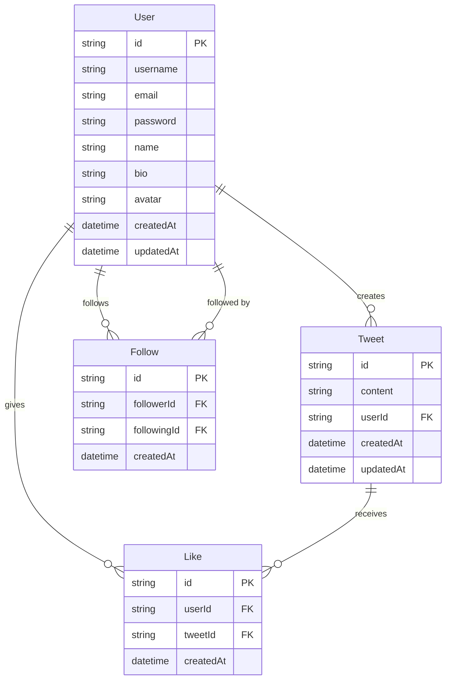

# Database Schema ER Diagram

This document provides an Entity-Relationship diagram for the Remix Twitter application database.

## ER Diagram

## Relationships

1. **User to Tweet**: One-to-Many
   - A user can create multiple tweets
   - Each tweet belongs to exactly one user

2. **User to Like**: One-to-Many
   - A user can like multiple tweets
   - Each like is associated with exactly one user

3. **Tweet to Like**: One-to-Many
   - A tweet can receive multiple likes
   - Each like is associated with exactly one tweet

4. **User to Follow (as follower)**: One-to-Many
   - A user can follow multiple users
   - Each follow relationship has exactly one follower

5. **User to Follow (as following)**: One-to-Many
   - A user can be followed by multiple users
   - Each follow relationship has exactly one user being followed

## Constraints

- `User.username` and `User.email` are unique
- `Like` has a unique constraint on the combination of `userId` and `tweetId`
- `Follow` has a unique constraint on the combination of `followerId` and `followingId`
