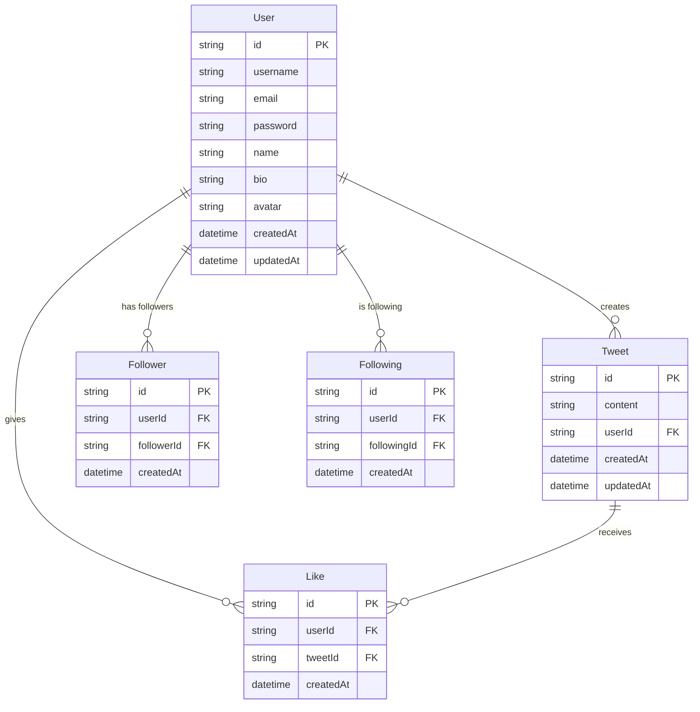

# Database Schema ER Diagram

This document provides an Entity-Relationship diagram for the Remix Twitter application database.

## ER Diagram

## Relationships

1. **User to Tweet**: One-to-Many
   - A user can create multiple tweets
   - Each tweet belongs to exactly one user

2. **User to Like**: One-to-Many
   - A user can like multiple tweets
   - Each like is associated with exactly one user

3. **Tweet to Like**: One-to-Many
   - A tweet can receive multiple likes
   - Each like is associated with exactly one tweet

4. **User to Follower**: One-to-Many
   - A user can have multiple followers
   - Each follower relationship connects a user with one of their followers

5. **User to Following**: One-to-Many
   - A user can follow multiple other users
   - Each following relationship connects a user with someone they are following

## Constraints

- `User.username` and `User.email` are unique
- `Like` has a unique constraint on the combination of `userId` and `tweetId`
- `Follower` has a unique constraint on the combination of `userId` and `followerId`
- `Following` has a unique constraint on the combination of `userId` and `followingId`
